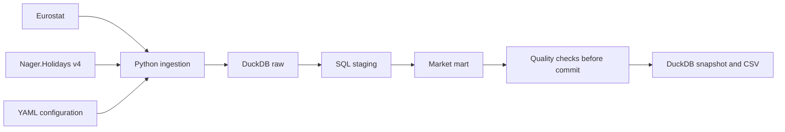

# European Market Intelligence Data Product

A reproducible batch pipeline combining Eurostat regional socioeconomic data and
national public holidays into a market-level dataset for European mobility analysis.

External market context comes from sources with different identifiers, time periods
and structures. This project maps eight markets to verified statistical regions and
produces one reusable table for downstream forecasting, pricing or planning work.
It does not forecast demand or recommend routes and is not affiliated with a mobility company.

## Output

**One row represents one configured market**, identified by `market_id`:
Berlin, Hamburg, Munich, Vienna, Prague, Amsterdam, Brussels and Paris.

Run the pipeline to create `data/market_intelligence.duckdb`, containing
`mart.market_intelligence`, and [the sample CSV](data/sample_market_intelligence.csv).

The demo uses **2024 population and density, 2023 GDP, and 2026 holidays**, with
`as_of_date=2026-09-21`. A complete common 2024 snapshot was unavailable: four
markets lacked GDP. Moving everything to 2023 would lose Amsterdam density under
its current region code. Each source's actual year is included in the output;
`socioeconomic_reference_year` is NULL when they differ. There is no automatic
fallback to another year. See [the evidence](docs/SOURCE_VERIFICATION.md) and
[decision log](docs/DECISIONS.md).

## Architecture



Python handles HTTP, JSON-stat parsing, configuration, logging and orchestration.
SQL handles casts, population age shares, holiday filtering and joins. The configured
market dimension is the left side of the final joins so missing markets remain visible.

## Sources

| Source | Dataset / endpoint | Demo selection |
|---|---|---|
| [Eurostat population](https://ec.europa.eu/eurostat/databrowser/view/demo_r_pjanaggr3/default/table?lang=en) | `demo_r_pjanaggr3` | 2024, `NR`, both sexes, total and three broad age groups |
| [Eurostat density](https://ec.europa.eu/eurostat/databrowser/view/demo_r_d3dens/default/table?lang=en) | `demo_r_d3dens` | 2024, `PER_KM2` |
| [Eurostat regional GDP](https://ec.europa.eu/eurostat/databrowser/view/nama_10r_3gdp/default/table?lang=en) | `nama_10r_3gdp` | 2023, `PPS_EU27_2020_HAB` |
| [Nager.Holidays](https://nagerholidays.com/api) | `/api/v4/Holidays/{CountryCode}/{Year}` | 2026, national public holidays only |

GDP is in purchasing power standards per inhabitant, not euro or an index against
the EU average. NUTS 3 regions are geographic proxies, not necessarily city boundaries;
Amsterdam uses Groot-Amsterdam (`NL32B`). Source status flags, URLs and update times
remain inspectable in the raw Eurostat tables.

## Run locally

### Local browser presentation

Install the optional UI with `python -m pip install -e '.[app]'`, then run
`python -m streamlit run streamlit_app.py` from the project folder.
Open **http://127.0.0.1:8501** in your browser. On this configured Windows computer,
double-click **Open Market Dashboard.cmd** instead; keep its terminal open while
using the app. Press Ctrl+C in that terminal to stop the server.

The presentation includes the pipeline flow, live refresh logs, a market selector,
the result table, a CSV download and a fresh check of the saved mart. The run button
invokes the same CLI pipeline as the terminal. It requires internet access; viewing
an existing snapshot does not. The UI reads DuckDB rather than trusting a possibly
older CSV. Only one browser-triggered refresh can run at a time in a server process.

### Terminal and initial setup

On an already configured Windows computer, double-click **Run Market Pipeline.cmd**
in this folder. A separate terminal shows the live fetch, a summary of the data
layers, and the eight market results, then waits until you close it. Codex is not
required. Open `data/sample_market_intelligence.csv` in Excel to inspect the full
output. For a fresh checkout, complete the setup below first.

Use Python **3.12 or 3.13** from a checkout of this repository. No API key is needed.
Live runs require internet access.

```bash
python -m venv .venv
source .venv/bin/activate
python -m pip install -e '.[dev]'
python -m src.pipeline --config config/project.yml
python -m pytest -q
python -m ruff check .
python -m ruff format --check .
```

On Windows PowerShell, select a supported interpreter and run it directly if
activation is restricted:

```powershell
py -3.13 -m venv .venv
.\.venv\Scripts\python.exe -m pip install -e '.[dev]'
.\.venv\Scripts\python.exe -m src.pipeline --config config/project.yml
.\.venv\Scripts\python.exe -m pytest -q
.\.venv\Scripts\python.exe -m ruff check .
.\.venv\Scripts\python.exe -m ruff format --check .
```

With GNU Make and the environment activated, `make run`, `make test`, `make lint`
and `make all` provide the same commands. `make all` includes the live run;
normal GitHub Actions runs only lint and offline tests on Python 3.12 and 3.13.
If using uv, `uv pip install --python .venv/Scripts/python.exe -e '.[dev]'`
is an alternative installer on Windows.

Configuration paths resolve relative to `config/project.yml`. The DuckDB database
is local and ignored by Git. The CSV is a real successful live output, not test data.

## Reliability and modelling

- Validated NUTS codes and labels connect socioeconomic sources; city names are not join keys.
- Age shares use the source `TOTAL` denominator, with explicit under-15, 15–64 and 65+ groups.
- Required-source failures abort the refresh. No missing GDP is silently replaced or published.
- Raw, staging and mart tables rebuild in one transaction; validation failure preserves the previous snapshot.
- Repeated runs with unchanged inputs produce the same business rows; `loaded_at_utc` changes.
- The CSV is atomically replaced after database commit. If replacement fails, rerun to export the authoritative database snapshot.
- National public-holiday dates are deduplicated. The 30-day window excludes today and includes day 30.
- Only the configured holiday year is covered. Cross-year 30-day windows fail rather than undercounting.

The [data contract](docs/DATA_CONTRACT.md) documents every output column and
nullability rule. The mart includes identity fields, population and density,
three age shares, GDP per inhabitant, holiday features, per-source years and load metadata.

## Data quality and tests

Before commit, the pipeline checks complete market coverage, uniqueness, required
values, configured identifiers/years, positive finite metrics, age-share ranges
and their sum, national calendar coverage and calendar-feature consistency.

Offline tests cover real API fixtures, sparse/dense JSON-stat, missing observations,
changed region metadata, malformed holiday responses, same-day and day-30 boundaries,
duplicate holiday dates, reruns and rollback after failed refreshes. Socket connections
to external hosts are blocked in the test suite; local asyncio wake-up connections
are allowed for UI tests. Fixtures are described in [tests/fixtures](tests/fixtures/README.md).

## Query the mart

Open the database with DuckDB, for example in Python:

```python
import duckdb

con = duckdb.connect("data/market_intelligence.duckdb", read_only=True)
print(con.sql("SELECT market_name, population_total FROM mart.market_intelligence"))
```

Compare market context while keeping source years visible:

```sql
SELECT market_name, population_total, population_density_per_km2,
       gdp_per_capita_pps, population_reference_year, density_reference_year,
       gdp_reference_year
FROM mart.market_intelligence
ORDER BY population_total DESC;
```

Find markets with a national public holiday in the next 30 days:

```sql
SELECT market_name, next_public_holiday_date, next_public_holiday_name,
       days_until_next_public_holiday, public_holidays_next_30d, as_of_date
FROM mart.market_intelligence
WHERE public_holidays_next_30d > 0
ORDER BY next_public_holiday_date, market_name;
```

## Limitations and possible production changes

This is an independent portfolio project with eight market proxies, mixed
socioeconomic source years, national holidays only and no historical snapshots.
Statistical observations can be provisional and later revised. A null next holiday
means none remains within the fetched year. Live runs depend on external availability.
There is no scheduler, monitoring service or demand model. The optional Streamlit
interface is a local presentation layer, not a deployed multi-user service.

A production version would need scheduled orchestration, freshness monitoring and
alerting, versioned snapshots, stronger source contracts, reviewed geographic
crosswalks and broader calendar coverage. A warehouse could replace the local
database if scale and downstream access require it.

## Repository layout

```text
config/                   Market identities, paths, dates and source selections
src/                      Python clients, validation, loading and orchestration
sql/                      Four staging transformations and the market mart
tests/fixtures/           Small captured public API responses
tests/                    Parser, quality, calendar and pipeline tests
data/sample_market_intelligence.csv
docs/                     Implemented contract, source checks and decisions
.github/workflows/ci.yml   Offline lint and test checks
Makefile
pyproject.toml
```
